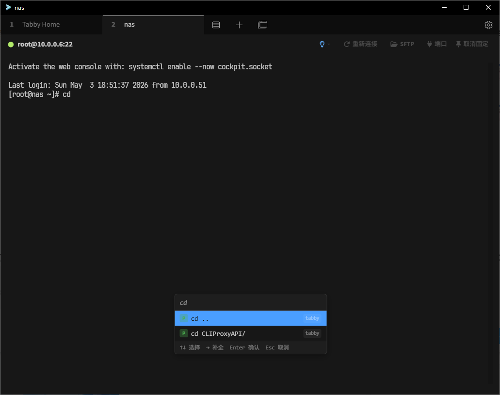

# tabby-command-tips

Tabby 终端命令历史提示插件。根据用户输入实时匹配历史命令，以下拉列表展示候选，支持键盘/鼠标选择后一键注入终端。

## 预览



## 功能特性

- **多 Shell 历史解析** — 自动读取 Bash、Zsh、Fish、PowerShell 的历史文件，同时整合 Tabby 自身记录
- **双层匹配策略** — 前缀优先 + 模糊兜底，兼顾精确和宽松的补全需求
- **热度排序算法** — 指数衰减（最近使用）+ log2 频率加权，常用命令自动排在前面
- **可配置触发** — 最少输入字符数、防抖延迟、最大结果数均可调
- **下拉列表交互** — 支持 ↑↓ 键盘导航、Enter 选择、→ 快速补全、鼠标点击、Esc 关闭
- **终端转义序列过滤** — 正确处理方向键等终端转义序列，避免显示乱码
- **LLM 增强匹配** — 可选集成 LLM 提供智能命令补全和建议
- **设置页面** — 在 Tabby 设置中可视化调整匹配模式、排序权重、显示选项

## 安装

```bash
# 方式一：npm 发布后从 Tabby 插件市场安装
# 方式二：本地开发
git clone https://github.com/MuWinds/tabby-command-tips.git
cd tabby-command-tips
npm install
npm run build
```

构建产物位于 `dist/index.js`，在 Tabby 的插件设置中指向该文件即可加载。

## 开发

```bash
# 构建
npm run build

# 监听模式（文件变更自动重编译）
npm run watch

# 运行测试
npm run test
```

## 配置项

在 Tabby 设置 → Command Tips 中可调整以下选项：

| 配置项 | 默认值 | 说明 |
|--------|--------|------|
| `enabled` | `true` | 启用/禁用插件 |
| `minChars` | `2` | 触发匹配的最少输入字符数 |
| `debounceMs` | `300` | 输入防抖延迟（毫秒） |
| `maxResults` | `20` | 下拉列表最大显示条数 |
| `matching` | `prefix-fuzzy` | 匹配模式：仅前缀 / 仅模糊 / 前缀优先+模糊兜底 |
| `scoring.recencyWeight` | `0.7` | 最近使用权重（0~1） |
| `scoring.frequencyWeight` | `0.3` | 使用频率权重（0~1） |
| `scoring.halfLifeDays` | `7` | 热度半衰期（天） |
| `showSourceTag` | `false` | 是否显示来源标签（shell/tabby） |
| `tabCompletesFirst` | `true` | Tab 键是否优先选中第一条 |
